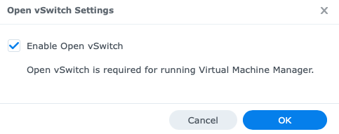
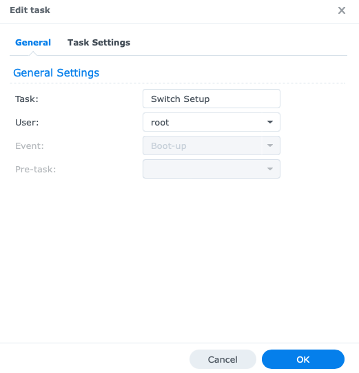
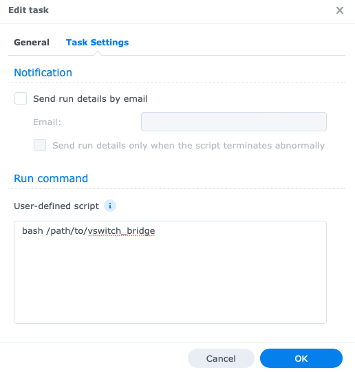

# Synology-Bridging

This script enables you to create a network bridge between two Ethernet ports on
your Synology NAS. As it works right now, it will connect ports 0-3 to port 4,
but it should be easily customizable.

## Don't

Using your NAS as a switch might work, but it might _super_ not. For us it
worked for a while, but every now and then it would just break. If you aren't
really broke and need to save the 200$ for a switch, you probably should not do
this.

## Prerequisites

- DSM >= 6.1
- A Synology NAS with at least two Ethernet ports
- Administrator account on DSM
- Open vSwitch enabled



## Instructions

- Upload the script to an arbitrary folder (preferably one that only
  Administrators can edit)
- Launch Control Panel on DSM and go to Task Scheduler
- Click the “Create” button on the top. Select “Triggered Task” → ”User-defined
  script”
- Type any title you wish and select the `root` user



- Move to “Task Setting” tab
- Type (or copy-paste) into the text box:

```
bash /path/to/vswitch_bridge
```



- Click the “OK” button
- Choose the “Enable Task” box
- Reboot (or run it once manually)
